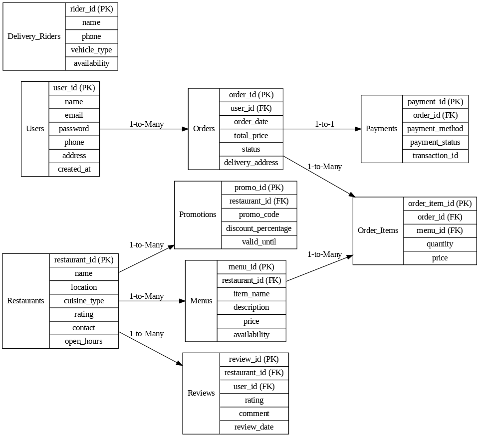

<!DOCTYPE html>
<html lang="en">
<head>
  <meta charset="UTF-8">

</head>
<body>

  <h1>🍔 Online Food Delivery System</h1>
  
<strong>Technology:</strong> MySQL

  
This project is a database system for an online food delivery service. It manages users, restaurants, menus, orders, payments, reviews, and delivery riders.

  <h2>📌 Features</h2>
  <ul>
    <li>User registration and login system</li>
    <li>Restaurant details with location and cuisine types</li>
    <li>Menu items management by restaurants</li>
    <li>Promotions and discounts with promo codes</li>
    <li>Placing and tracking food orders</li>
    <li>Payment records for each order</li>
    <li>User reviews and ratings for restaurants</li>
    <li>Delivery rider availability management</li>
  </ul>

  <h2>🗂️ Entity Relationship Diagram (ERD)</h2>
  
See the ERD image below:

  

  <h2>🧱 Database Tables</h2>
  <ul>
    <li>Users</li>
    <li>Restaurants</li>
    <li>Menus</li>
    <li>Promotions</li>
    <li>Orders</li>
    <li>Order_Items</li>
    <li>Payments</li>
    <li>Reviews</li>
    <li>Delivery_Riders</li>
  </ul>

  <h2>🚀 Getting Started</h2>
  
To get started:

  <ol>
    <li>Clone the repository</li>
    <li>Import the SQL file into your MySQL database</li>
    <li>Use MySQL Workbench or phpMyAdmin to explore the schema</li>
  </ol>

  <h2>✅ Future Improvements</h2>
  <ul>
    <li>Add stored procedures and triggers</li>
    <li>Integrate with a front-end website or mobile app</li>
    <li>Develop RESTful APIs for full-stack integration</li>
  </ul>

  <h2>📄 License</h2>
  
This project is created for academic and educational purposes only.

</body>
</html>
